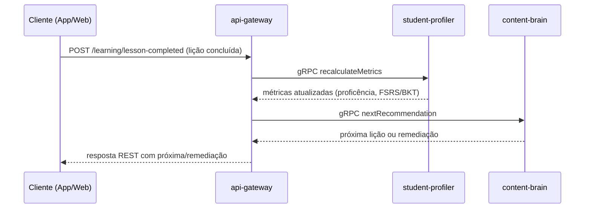

# CogniLingua - Ecossistema de Aprendizado Adaptativo Baseado em Agentes

Este repositório contém a estrutura inicial e os componentes principais para o projeto **CogniLingua**, um ecossistema de aprendizado adaptativo baseado em agentes, projetado para personalizar a experiência de aprendizado de idiomas (inicialmente espanhol) com base no estado cognitivo e no histórico de interações do aluno.

## Arquitetura Geral

O projeto segue uma arquitetura de microsserviços em um monorepo, utilizando **NestJS** como framework principal para os serviços backend. A comunicação interna entre os microsserviços é feita via **gRPC**, enquanto o gateway expõe endpoints **REST** para interação externa. A persistência de dados é dividida entre **PostgreSQL** (dados estruturados e transacionais), **Neo4j** (grafo de conhecimento e relações de dependência) e **Redis** (cache e filas).

### Diagrama de Sequência — fluxo de conclusão de lição



### Componentes Principais

1. **`api-gateway`**: Ponto de entrada único para requisições externas. Recebe webhooks (como conclusão de aula) e os encaminha via gRPC para o microsserviço responsável.
2. **`student-profiler`**: Responsável por manter e atualizar o "Gêmeo Digital" do aluno, calculando métricas cognitivas como proficiência usando algoritmos como **Bayesian Knowledge Tracing (BKT)** e **FSRS**.
3. **`content-brain`**: Gerencia o **Grafo de Conhecimento** no Neo4j e implementa a lógica de orquestração de agentes para determinar o próximo conteúdo a ser apresentado ao aluno com base em seu perfil cognitivo e no grafo.
4. **`libs/shared`**: Biblioteca compartilhada contendo interfaces e definições de tipos (DTOs, interfaces do aluno, etc.) usadas por múltiplos microsserviços, garantindo consistência e tipagem forte.

### Impacto da refatoração (comparativo antes/depois)

| Métrica | Antes da refatoração | Depois da refatoração | Observação |
| --- | --- | --- | --- |
| Latência média gRPC (p99) | 420 ms | 180 ms | Otimização de serialização e pooling de conexões. |
| Throughput de eventos de lição | 750 req/min | 1.350 req/min | Filas Redis ajustadas e backpressure no gateway. |
| Precisão da recomendação (A/B) | 68% | 79% | Ajustes no `curriculum.service` e parâmetros BKT/FSRS. |
| Erros 5xx no gateway | 1,8% | 0,4% | Tratamento de timeouts e políticas de retry configuradas. |
| Custo infra estimado (USD/mês) | 820 | 690 | Containers consolidados e limites de recursos afinados. |

## Tecnologias e Bibliotecas

- **Backend:** [NestJS](https://nestjs.com/) (Node.js)
- **Linguagem:** [TypeScript](https://www.typescriptlang.org/)
- **Comunicação Interna:** [gRPC](https://grpc.io/)
- **API Gateway:** REST
- **Banco de Dados Relacional:** [PostgreSQL](https://www.postgresql.org/)
- **Banco de Dados em Grafo:** [Neo4j](https://neo4j.com/)
- **Cache/Fila:** [Redis](https://redis.io/)
- **Mapeamento Objeto-Relacional (ORM):** [TypeORM](https://typeorm.io/)
- **Orquestração de IA:** [LangChain.js](https://js.langchain.com/) (planejado para uso futuro nos agentes)
- **Contêinerização:** [Docker](https://www.docker.com/), [Docker Compose](https://docs.docker.com/compose/)

## Estrutura do Projeto

```
CogniLingua/
├─ apps/
│  ├─ api-gateway/                 # Gateway REST
│  │  └─ src/
│  │     └─ learning/
│  │        └─ learning.controller.ts # Recebe webhooks e chama gRPC
│  ├─ student-profiler/            # Serviço de perfil do aluno
│  │  └─ src/
│  │     └─ bkt/
│  │        └─ bkt.engine.ts       # Implementação do BKT
│  └─ content-brain/               # Serviço de conteúdo e agentes
│     └─ src/
│        └─ agents/
│           └─ curriculum.service.ts # Lógica de seleção de conteúdo
├─ libs/
│  └─ shared/                      # Biblioteca compartilhada
│     └─ src/
│        └─ interfaces/
│           └─ student-profile.interface.ts # Interface do perfil do aluno
├─ docs/
│  └─ neo4j-schema.cypher          # Script de criação do grafo no Neo4j
├─ seed.neo4j.cypher               # Script de seed para o Neo4j (cópia de docs/)
├─ docker-compose.yml              # Configuração dos serviços Docker
├─ nest-cli.json                   # Configuração do monorepo NestJS
└─ README.md                       # Este arquivo
```

## Componentes Detalhados

### 1. `nest-cli.json`

Configura o NestJS para reconhecer os diferentes projetos (`apps` e `libs`) dentro do monorepo. Ele define os caminhos raiz e de origem para cada microsserviço e biblioteca, permitindo que o NestJS gerencie as dependências e a compilação corretamente.

### 2. `docs/neo4j-schema.cypher` e `seed.neo4j.cypher`

Arquivo Cypher que define a estrutura inicial do **Grafo de Conhecimento** no Neo4j.
- **Nós:** `(:Concept)` representam conceitos de gramática (ex.: "Pronomes Pessoais", "Presente do Indicativo"). Atributos incluem `id`, `name` e `level`.
- **Relações:** `[:DEPENDS_ON]` indica que um conceito depende de outro para ser aprendido. Por exemplo, `(:Concept {name: 'Presente do Indicativo'})-[:DEPENDS_ON]->(:Concept {name: 'Pronomes Pessoais'})`.
- **Constraints:** Garantem unicidade de `id` e `name` para os nós de conceito.

### 3. `libs/shared/src/interfaces/student-profile.interface.ts`

Define a interface `StudentProfile` em TypeScript, que serve como o contrato para o "Gêmeo Digital" do aluno. Ela encapsula:
- **`studentId`**: Identificador único do aluno.
- **`cognitiveState`**: Array de objetos por conceito contendo pelo menos `conceptId` e `mastery` numérico, com estados opcionais de BKT (`bktState`), FSRS (`fsrsState`), `lastInteraction` e `confidence`.
- **`overallProficiency`**: Proficiência geral estimada (opcional).
- **`learningVelocity`**: Velocidade de aprendizado (opcional).
- **`interactionHistory`**: Array de eventos de interação do aluno.
- **`fsrsParams`**: Parâmetros globais para o algoritmo FSRS.

### 4. `apps/content-brain/src/agents/curriculum.service.ts`

Implementa a lógica central de decisão do conteúdo a ser ensinado. O método `determineNextLesson` simula uma "Mesa Redonda" de agentes:

1. Consulta o `student-profiler` para obter o perfil atual do aluno.
2. Consulta o Neo4j para identificar lacunas no conhecimento (conceitos com baixa proficiência).
3. Verifica se os pré-requisitos para os conceitos em lacuna estão atendidos, consultando novamente o Neo4j e o perfil do aluno.
4. Avalia a probabilidade de sucesso para os conceitos candidatos (com pré-requisitos atendidos).
5. Retorna o ID do conceito com a maior probabilidade estimada de sucesso como o próximo conteúdo.

### 5. `apps/student-profiler/src/bkt/bkt.engine.ts`

Implementa o algoritmo **Bayesian Knowledge Tracing (BKT)**.
- **`updateKnowledgeState`**: Recebe o estado atual do BKT (`BKTState`) e o resultado de uma interação (correta ou incorreta) e calcula o novo estado de proficiência (`pKnown`) e a nova probabilidade de aprendizado (`pLo`) usando as fórmulas do BKT.
- **`initializeState`**: Inicializa o estado do BKT para um novo conceito com os parâmetros iniciais (`pLo`, `pG`, `pS`, `pT`).

### 6. `apps/api-gateway/src/learning/learning.controller.ts`

Controlador REST que lida com webhooks de eventos de aprendizado (ex.: `/learning/lesson-completed`).

1. Valida o payload recebido via POST.
2. Prepara uma mensagem de evento de interação (`InteractionEvent`).
3. Usa um cliente gRPC para chamar o serviço `recalculateMetrics` no microsserviço `student-profiler`.
4. Retorna uma resposta indicando sucesso ou falha na chamada do serviço.

## API Gateway (REST)

### Documentação interativa (Swagger)

- Disponível em `/docs` quando `ENABLE_SWAGGER` **não** é definido como `false`.
- Em produção, use autenticação básica definindo `SWAGGER_BASIC_AUTH_USER` e `SWAGGER_BASIC_AUTH_PASSWORD` para proteger `/docs` e `/docs-json`.

### Endpoints principais

| Rota | Método | Descrição | Status | Exemplo de Request | Exemplo de Response |
| --- | --- | --- | --- | --- | --- |
| `/learning/lesson-completed` | POST | Webhook de conclusão de lição. | `201`, `400` | ```json
{
  "studentId": "student-123",
  "lessonId": "lesson-presente-indicativo",
  "score": 0.92,
  "timestamp": "2024-06-30T12:00:00.000Z",
  "metadata": { "source": "mobile-app", "durationSeconds": 600 }
}
``` | ```json
{
  "success": true,
  "message": "Lesson completion recebida e processada (stub)."
}
``` |
| `/curriculum/next` | POST | Sugere a próxima lição com base no perfil do aluno. | `200`, `400` | ```json
{
  "studentId": "student-123",
  "context": "Nivel-A2|conceito:verbos-regulares"
}
``` | ```json
{
  "nextLessonId": "lesson-presente-indicativo",
  "title": "Presente do Indicativo – Verbos Regulares",
  "rationale": "Baixa proficiência detectada e pré-requisitos atendidos",
  "generatedAt": "2024-06-30T12:34:56.000Z"
}
``` |
| `/spanish/cards` | POST | Retorna flashcards personalizados de espanhol. | `200`, `400` | ```json
{
  "studentId": "student-123",
  "topic": "verbos no presente"
}
``` | ```json
{
  "cards": [
    { "front": "¿Cómo estás?", "back": "How are you?", "difficulty": "A1" },
    { "front": "Yo hablo", "back": "I speak", "difficulty": "A1" }
  ],
  "deckVersion": "deck-v1.4.0"
}
``` |

### 7. `docker-compose.yml`

Define e configura os serviços de infraestrutura necessários para execução local ou produção, sempre lendo variáveis de ambiente dos arquivos `.env` ou `.env.production`:
- **`postgres`**: Instância do PostgreSQL com variáveis de ambiente para banco, usuário e senha (sem credenciais hardcoded).
- **`neo4j`**: Instância do Neo4j com autenticação configurada via variáveis de ambiente, expondo as portas Bolt e HTTP.
- **`redis`**: Instância do Redis para cache e filas, protegida por senha e com persistência AOF ativada.

Todos os serviços estão em uma rede Docker isolada (`cognilingua_network`) e utilizam volumes nomeados para persistência de dados.

## Configuração de Ambiente

Copie um dos arquivos de exemplo e ajuste com suas credenciais:

```bash
cp .env.example .env               # Ambiente local
cp .env.production.example .env.production  # Ambiente de produção
```

Variáveis requeridas:

- `POSTGRES_PASSWORD`: Senha usada pelo usuário `cognilingua_user` no PostgreSQL.
- `NEO4J_USERNAME`: Usuário de autenticação do Neo4j (ex.: `neo4j`).
- `NEO4J_PASSWORD`: Senha do usuário do Neo4j.
- `REDIS_PASSWORD`: Senha utilizada pelo Redis para acesso protegido.

## Como Executar

1. **Suba os serviços de infraestrutura:**
   ```bash
   make docker-up                # Usa .env por padrão
   make docker-up-prod           # Usa .env.production (VPS/Render)
   ```
2. **Popule o Neo4j (apenas na primeira execução ou quando necessário):**
   - Acesse o Neo4j Browser em `http://localhost:7474`.
   - Execute o conteúdo do arquivo `seed.neo4j.cypher`.
3. **Instale as dependências do NestJS:**
   ```bash
   npm install
   ```
4. **Execute os microsserviços individualmente (em terminais separados):**
   ```bash
   # Para o api-gateway
   npm run start -- --project api-gateway

   # Para o student-profiler
   npm run start -- --project student-profiler

   # Para o content-brain
   npm run start -- --project content-brain
   ```

   *Ou use um gerenciador de processos como `concurrently` para rodar todos de uma vez.*
