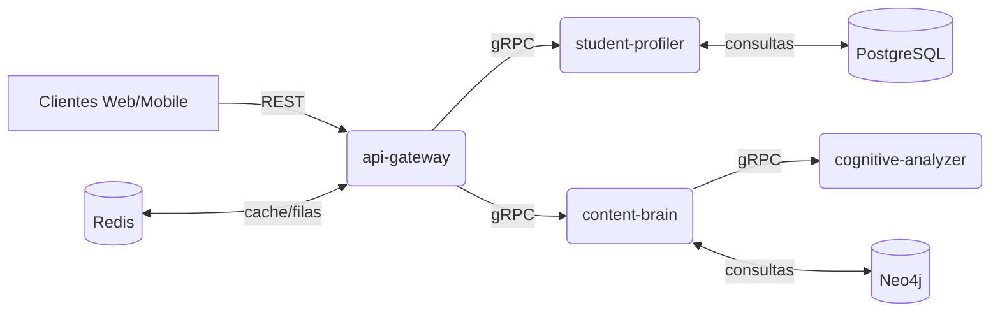
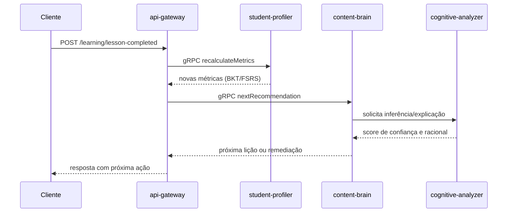

# CogniLingua

Plataforma de aprendizado adaptativo de idiomas construída sobre um monorepo NestJS + Next.js. O projeto combina serviços de recomendação, análise cognitiva e entrega de conteúdo para personalizar a jornada de estudo de cada aluno.

## Visão geral

- **Backend**: microsserviços em NestJS comunicando-se via gRPC e expondo um gateway REST.
- **Front-end**: app Next.js (apps/web) para o painel e experiências do aluno.
- **Persistência**: PostgreSQL para dados transacionais, Neo4j para o grafo de conhecimento e Redis para cache/filas.
- **Observabilidade**: endpoints de healthcheck em todos os serviços; métricas de desempenho e perfilagem no `cognitive-analyzer`.

### Macroarquitetura



### Fluxo chave: conclusão de lição



## Serviços e bibliotecas

- **apps/api-gateway**: expõe endpoints REST, traduz chamadas para gRPC e aplica validações.
- **apps/student-profiler**: mantém o gêmeo digital do aluno, atualiza proficiência com BKT/FSRS e persiste eventos.
- **apps/content-brain**: orquestra seleção de próxima lição usando grafo de conhecimento e sinais cognitivos.
- **apps/cognitive-analyzer**: processa métricas, healthchecks e consultas Redis; atua como coprocessador analítico.
- **apps/web**: front-end Next.js para dashboards e superfícies de aprendizado.
- **libs/shared**: DTOs, contratos gRPC e tipos usados entre serviços.

## Requisitos

- Node.js 20+
- Docker e Docker Compose
- Make (para atalhos do `Makefile`)

## Configuração de ambiente

1. Copie um arquivo de exemplo:
   ```bash
   cp .env.example .env
   cp .env.production.example .env.production
   ```
2. Ajuste credenciais mínimas:
   - `POSTGRES_PASSWORD`
   - `NEO4J_USERNAME` e `NEO4J_PASSWORD`
   - `REDIS_PASSWORD`

## Execução local rápida

1. **Subir infraestrutura** (Postgres, Neo4j, Redis):
   ```bash
   make docker-up
   # ou make docker-up-prod para usar .env.production
   ```
2. **Instalar dependências**:
   ```bash
   npm install
   ```
3. **Rodar serviços NestJS (terminais separados ou usando tmux/concurrently)**:
   ```bash
   npm run start -- --project api-gateway
   npm run start -- --project student-profiler
   npm run start -- --project content-brain
   npm run start -- --project cognitive-analyzer
   ```
4. **Rodar front-end**:
   ```bash
   npm run dev:web
   ```

## Scripts úteis

- `npm run build` — compila os serviços NestJS.
- `npm run start:prod` — inicia o `api-gateway` usando a build gerada em `dist`.
- `npm run build:web` / `npm run start:web` — build e servidor Next.js.
- `npm run lint` — lint com ESLint + Prettier.
- `npm run test` — suíte de testes com Jest (inclui unitários e e2e configurados em `apps/api-gateway/test`).

## Estrutura do repositório

```
CogniLingua/
├─ apps/
│  ├─ api-gateway/
│  ├─ student-profiler/
│  ├─ content-brain/
│  ├─ cognitive-analyzer/
│  └─ web/
├─ libs/
│  └─ shared/
├─ docs/               # scripts e referências (ex.: schema Neo4j)
├─ scripts/            # utilitários de build/deploy
├─ docker-compose.yml  # infraestrutura local/prod
├─ Makefile            # atalhos docker-up/down/logs
└─ README.md
```

## Próximos passos sugeridos

- Adicionar pipelines CI (lint + test) no GitHub Actions.
- Publicar documentação OpenAPI/Swagger com auth básica habilitada por ambiente.
- Automatizar seed do Neo4j via script no `make docker-up`.
- Integrar tracing e métricas em todos os serviços gRPC para acompanhar a jornada do aluno fim a fim.
